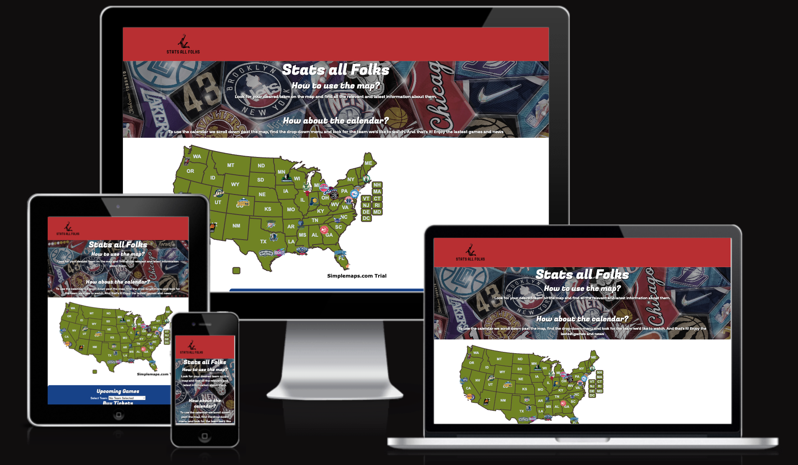
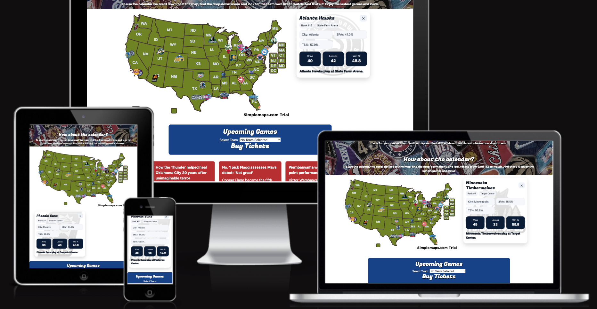
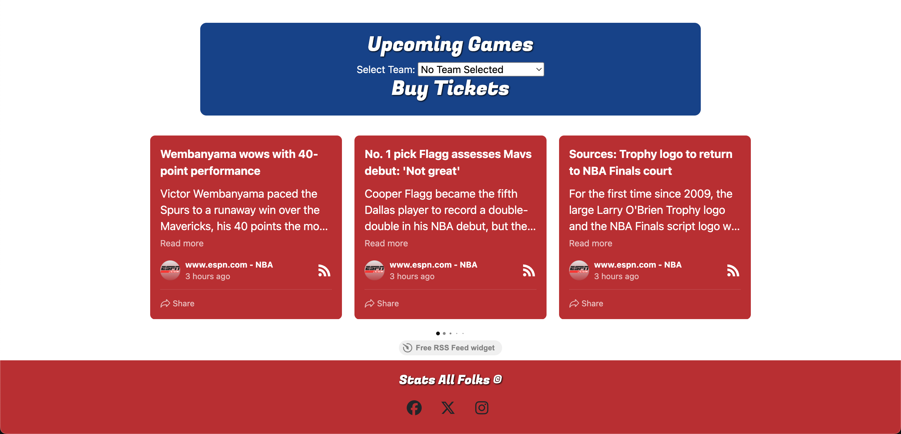
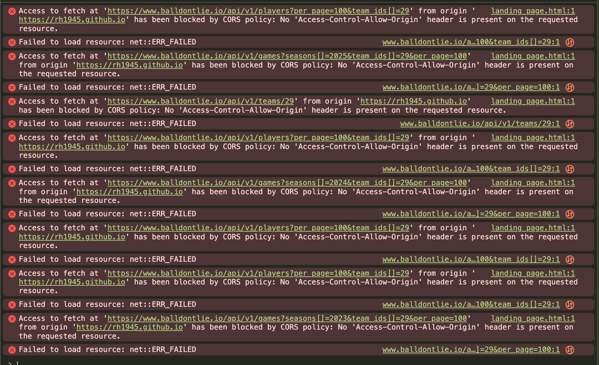
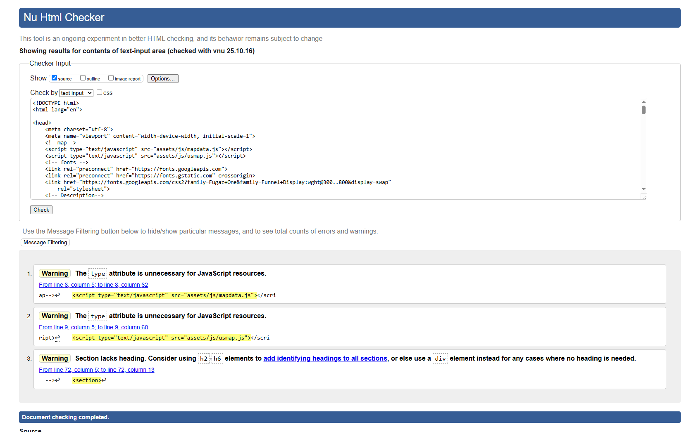
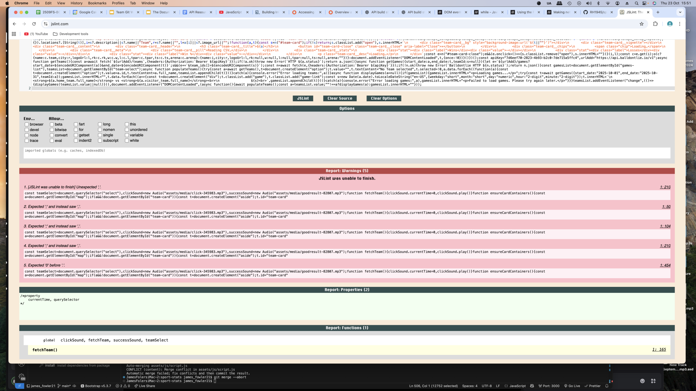

# 🏀 Sport-Stats — Interactive NBA Map
### [🔗 Live site](https://rh1945.github.io/sport-stats/)
*A responsive, searchable database of NBA teams demonstrating API integration, data visualization, and responsive UI/UX design.*

---

## 👥 Team

| Name              | Role              | GitHub / LinkedIn                                                                                  |
|-------------------|-------------------|----------------------------------------------------------------------------------------------------|
| Rafael H. Sanchez | Project Lead      | [GitHub](https://github.com/RH1945) / [LinkedIn](https://www.linkedin.com/in/rafael-horwood-sanchez-291914224/) |
| James Fowler      | Project Developer | [GitHub](https://github.com/jamesfowler-dev) / [LinkedIn](https://www.linkedin.com/in/jamesfowler21/) |
| Richard Duerden   | Project Developer | [GitHub](https://github.com/MoustacheCode) / [LinkedIn](https://www.linkedin.com/in/richard-duerden-692556227/) |

---

## 🧭 Index

- [Overview](#overview)
- [Features](#features)
- [Introduction](#introduction)
    - [Project Outline](#project-outline)
- [Architecture](#architecture)
- [Design](#design)
    - [Wireframes](#wireframes)
    - [Header](#the-header)
    - [Map](#the-map)
    - [Card Views](#card-in-different-views)
    - [Color Palettes](#color-palettes)
- [AI](#ai)
- [Team Experience](#team-experience)
- [Git](#git)
- [Libraries and Frameworks](#libraries-and-frameworks)
- [Development](#development)
- [Deployment](#deployment)
- [Testing](#testing)
    - [Known Bugs](#known-bugs)
- [Credits](#credits)

---

## 🧠 Overview

Sport-Stats is an interactive web application built during the **Code Institute Hackathon Full Stack (Oct 2025)**.  
It displays all 30 NBA teams on a responsive U.S. map. When a user clicks a team, a card slides out showing real-time 
statistics such as win/loss record, true shooting percentage, and home arena.

Originally designed to showcase API usage for the map, the project evolved into a clean, maintainable interface powered 
by both CSV-based data and external endpoints. And the Api is showcased with the use of a calendar which shows upcoming 
NBA games.

---

## 🌟 Features
- Interactive map displaying all NBA teams.
- Hover and click events reveal responsive team cards.
- Dynamic team stats loaded from CSV data.
- Fully responsive:
    - Side card on desktop
    - Stacked modal card on mobile
- Clear, modern interface using accessible color palettes.
- Built using **HTML5**, **CSS3**, and **Vanilla JavaScript** — no frameworks required.

---

## 🧩 Introduction

### Project Outline

The project started as a concept to visualize live NBA statistics via public APIs.  
Due to API access limitations and CORS restrictions, the team transitioned to a hybrid data solution — combining a 
curated CSV dataset with fallback API calls.  
The goal was to demonstrate **data integration**, **responsive design**, and **team collaboration**
under time constraints.

---

## 🏗️ Architecture

- **`landing_page.html`** – main structure and semantic layout.
- **`mapdata.js`** – defines map configuration.
- **`script.js`** – handles CSV loading, map events, and card rendering.
- **`styles.css`** – responsive and accessible visual design.

- /assets
- ├── css/styles.css
- ├── js/script.js
- ├── js/mapdata.js
- ├── images/
- └── hackathon-basketball/

---

## 🎨 Design

### Wireframes

The first idea was to create a fantasy team builder using API stats.  
Due to limited free API access, the scope pivoted to a **visual team map** with clear data insights.  
Wireframes were iteratively adjusted as responsiveness and real-time interactivity became the main goals.

---

### The Header

The header serves as a simple guide to using the site.  
The design intentionally mirrors the **NBA color palette**, using strong reds to evoke identity and trust.  
A subtle instructional paragraph helps users understand how to explore the map and stats.

---

### The Map

The map went through different version of responsiveness, the team tried to keep
it as the central idea for the website.
Integrating **Simplemaps.js** allowed flexible customization, though some z-index and event challenges required creative debugging.  
Cities were replaced with **NBA team locations**, including logos, and hover popups were simplified for clarity.

---

### Card in Different Views

The card design adapts between views:
- On desktop, it anchors beside the map.
- On mobile, it transitions into view under the map.  
  This behavior ensures accessibility and readability on all devices.

---

### Calendar

The Game Calendar section provides an intuitive and user-friendly interface to explore upcoming basketball matches. 
Users can choose a team from a dropdown menu to filter and view that team’s schedule, or leave it 
unselected to see a broader set of games. The calendar displays each game with essential details — home vs away teams,
date and time, and current status — in a clean and readable layout.
With this feature, visitors gain quick access to the months fixtures without leaving the site.

## Color Palettes

#### General Palette
The general theme adopts the official NBA colors to align the interface with its subject.

#### Map Palette
For the map background and regional hues, we used **earthy and desaturated tones** to maintain contrast without visual fatigue.

---

## 🤖 AI

### Purpose and Integration

Artificial Intelligence played a significant role in the development of this project — not as a content generator, but as a **collaborative coding assistant**.  
The primary goals were:
- To **accelerate prototyping** under tight hackathon deadlines.
- To **improve code clarity** and maintain a consistent style across contributors.
- To help translate design ideas into responsive and accessible CSS and JS implementations.
- To **debug complex DOM interactions** and resolve asynchronous data loading issues.

AI was treated as a **teammate for problem-solving**, rather than a code writer to replace manual work.

---

### Prompt Design and Iterative Workflow

The team used **structured, purpose-driven prompts** to communicate technical intent clearly.  
Prompts typically followed a 3-step approach:
1. **Context setup** — explaining the goal, the current code state, and known issues.
2. **Target request** — specifying exactly what needed to be built, refactored, or debugged.
3. **Constraint declaration** — listing requirements such as "vanilla JS only", "keep map responsive", or "maintain accessibility compliance."

This structure minimized AI “hallucinations” and ensured that all output aligned with our architecture.

Example:
> “We want the team card to open responsively next to the map on desktop and below on mobile, with clean animations and maintainable CSS. Please produce modular code without dependencies.”

Through iterative refinement, we were able to:
- Rebuild the **map-card interaction system** from scratch using pure JS.
- Redesign **CSS responsiveness** so the card smoothly transitions without scroll bugs.
- Prototype **new layouts** (75/25 split, full-screen mobile modal, stacked layouts) and choose the best-performing option.
- Convert the background filter effect from a destructive container filter to a safe pseudo-element solution.

---

### Ethical and Practical Considerations

All AI-generated code was:
- **Reviewed, edited, and tested manually** by the development team.
- **Rewritten for maintainability**, ensuring future contributors could understand and extend it.
- **Compliant with academic and professional integrity standards** for hackathon participation.

AI was **never used** to fabricate data or bypass restrictions — only to optimize development flow and assist 
in producing cleaner, reusable code.

---

### Reflection

Integrating AI into the workflow proved transformative.  
It functioned as:
- A **pair-programmer** that could instantly reframe a solution.
- A **technical mentor**, explaining specific JavaScript or CSS quirks.
- A **design assistant**, helping articulate and visualize front-end responsiveness.

Ultimately, it taught the team to **communicate more precisely** — because the quality of results depended entirely on the clarity of our prompts.  
This mirrored the same precision needed in professional collaborative development.

*“The best output we got wasn’t from asking AI to write code — it was from teaching it how we think.”*

A mixture of Claude, OpenAI, ChatGPT5, and CoPilot were used throughout the whole project.
(yes, this whole AI section was written by AI, just for irony's sake.)

## 👩‍💻 Team Experience

---

All the issues we encountered were crossed and a MVP was achieved. We used git to develop the website, VSCode and Webstorm.
Discord was used for all the communication, spending almost the entire dev time on call. 
Sharing discussing and learning together.

### Team Reflections

"It was an absolute pleasure working with Rafael and Richard during the 4-day Hackathon. Their creativity, teamwork,
and problem-solving skills made the experience both enjoyable and productive. We collaborated seamlessly, shared ideas
openly, and supported each other under tight deadlines. I’m really proud of what we achieved together —
it was a great example of what strong teamwork can accomplish in such a short time."

## 🧰 Git

---

The project was managed entirely via **GitHub** with feature branches and pull requests.  
Each major section (map, card, responsiveness) was developed in collaboration and merged through code review.  
Commit history was kept descriptive to ensure clarity during the hackathon.

## 🧱 Libraries, technologies and Frameworks

---

- [Simplemaps.js](https://simplemaps.com/docs/) — interactive U.S. map
- [PapaParse](https://www.papaparse.com/) — CSV parsing
- [Google Fonts](https://fonts.google.com/) — typography
- Native **HTML5 / CSS3 / JS**

## Extra sources (Videos, docs and guides)

---

- [**NBA Teams Transparent PNGs – StickPNG**](https://www.stickpng.com/cat/sports/basketball/nba-teams?page=1)  
  A free image repository of transparent PNG logos for all NBA teams.  
  Used to source high-quality team logos displayed on the interactive cards.

- [**YouTube Video – Intro to Simplemaps**](https://www.youtube.com/watch?v=pBASqUbZgkY)  
  A walkthrough demonstrating how to integrate and customize the Simplemaps U.S. map library.  
  Helped us configure click and hover interactions for our NBA team map.

- [**YouTube Video – Customising Simplemaps Interactions**](https://www.youtube.com/watch?v=ZaZptPNRw_8&pp=ygUWY3VzdG9taXNpbmcgc2ltcGxlbWFwcw%3D%3D)  
  A deeper dive into advanced Simplemaps features such as overlays, markers, and responsiveness.  
  Served as inspiration for refining our map’s dynamic behaviour.

- [**jQuery.getJSON() Documentation**](https://api.jquery.com/jQuery.getJSON/)  
  The official jQuery API documentation for the `$.getJSON()` method.  
  Used as reference when implementing data fetching from our CSV and JSON sources.

- [**ballDontLie API – app.balldontlie.io**](https://app.balldontlie.io/)  
  The interactive portal for the free ballDontLie basketball API, which provides player, team, and game stats.  
  Served as our initial live data source before migrating to a CSV-based offline dataset.

- [**Cross-Origin Resource Sharing (CORS) – web.dev**](https://web.dev/articles/cross-origin-resource-sharing?utm_source=devtools&utm_campaign=stable)  
  An official Google Web.dev article explaining CORS restrictions and debugging strategies.  
  Helped us understand why browser-based API calls were blocked and how to fix them.

- [**GitHub – balldontlie-api/mcp**](https://github.com/balldontlie-api/mcp)  
  The official GitHub repository for the Model Context Protocol (MCP) implementation of the ballDontLie API.  
  Provided insight into the API’s structure and endpoint logic used for advanced reference.

## 💻 Development

---

Development followed a modular approach:
1. Build the static layout (HTML + CSS).
2. Integrate and customize Simplemaps.
3. Implement CSV parsing and card generation.
4. Debug z-index and responsiveness across breakpoints.
5. Polish UX with animations and consistent branding.
6. Testing, debugging, documenting, and presenting.

The primary issue when developing the map team API was with CORS, we tried using  
a local proxy to make the data appear as same-origin, but the proxy would not be able
to jump over the CORS problem, so it shot back 404 errors to the main page.

We decided to change the API element of the website to just the calendar. This was the biggest hurdle of the project
taking us about 1.5 days to decide against it.
* Improvements with more time
  - Adjust font size of the select options and Buy Tickets to improve accessibility
  - Create hover function for buy Tickets to aide accessibility
  - Adjust dates for games displayed to full season
  - Include scores for each fixture

    
## 🚀 Deployment

---

The site is hosted via **GitHub Pages** directly from the `main` branch.  
To deploy updates:
1. Commit and push to `main`.
2. Wait for GitHub Pages to rebuild.
3. Visit [rh1945.github.io/sport-stats](https://rh1945.github.io/sport-stats/).

## 🧪 Testing

---

Testing included:
- Device compatibility, Phone, laptop and large desktop physical tests.
- Responsiveness checks with Chrome DevTools.
- CSV data integrity validation.
- Manual QA for mobile UX (tap targets, modal closing).
- Lighthouse, `https://www.jslint.com/`, `https://validator.w3.org/nu/#textarea` and `https://jigsaw.w3.org/css-validator/validator`

In all our testing we encountered some warnings and lower score but managed to lear which 
ones to worry about, we made sure the website was working in real use tests, consulted our tutors
and fixed as many bugs as we could before the deadline, ensuring the most important ones were obliterated.

The Nu html check did not recognise some resources, so we had to check what was wrong and 
debug independently. Simplemaps uses a script to ensure it is displaying the logo if it's not paid.

Our css check found no errors.

The minified scrip apparently had some issues because of the VScode plug-in "Prettier". But it worked regardless.

## Known Bugs

---

- A white gap might show between map and card when resizing the window.
- Map scaling occasionally clips logos when zooming on smaller devices.
- Calendar is showing games that have already happened.
- Calendar text inside the box displaying in blue on deployed site

## 🙌 Credits

---

- **Code Institute Hackathon (Oct 2025)** — organization and mentoring.
- **Simplemaps.com** — for their free U.S. map implementation.
- **NBA.com**, **ESPN.com**, and **balldontlie** — for team stats and inspiration.
- Thank you, Mark Briscoe and Dillon MCcaffrey for the tutoring, and project direction.

---

*Made with code by Rafael, James and Richard*
