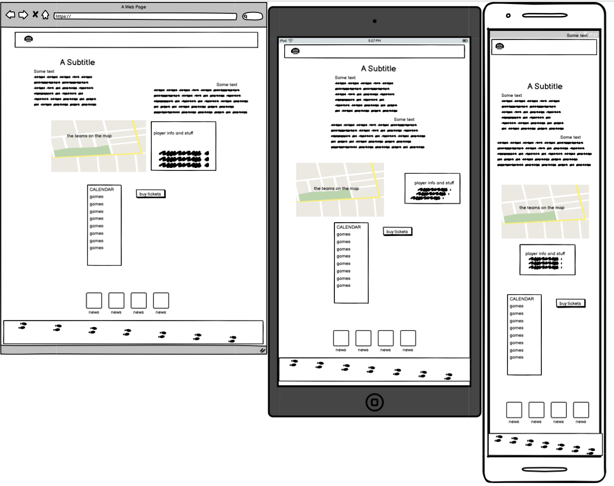
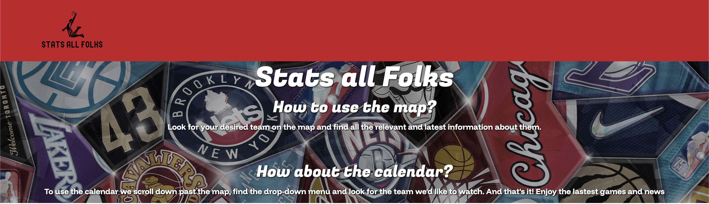
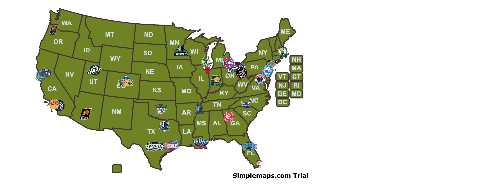
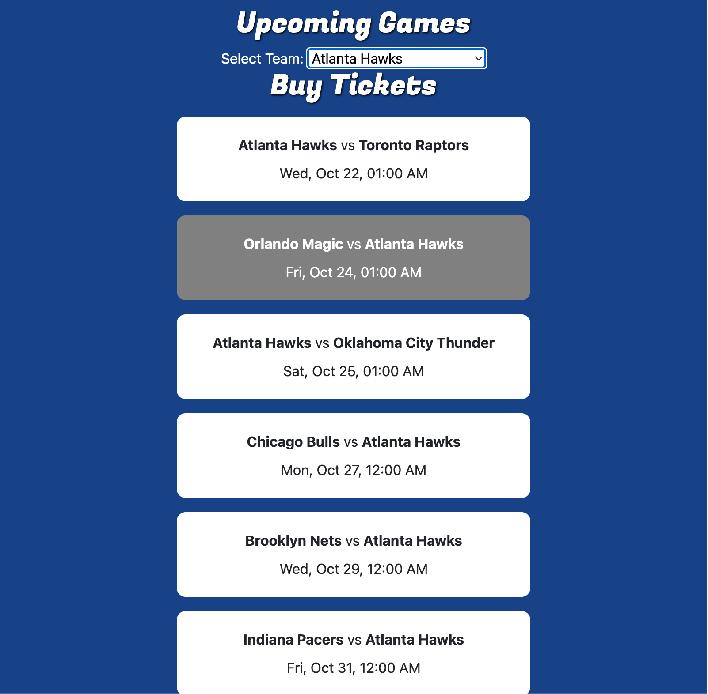

# sport-stats
## https://rh1945.github.io/sport-stats/
A responsive, searchable database of NBA players showcasing an API implementation. Hackathon Code Institute/Oct 2025.

| Name              | Role           | GitHub / LinkedIn                                                                         |
|-------------------|----------------|-------------------------------------------------------------------------------------------|
| Rafael H. Sanchez | Project Lead   | https://github.com/RH1945 / https://www.linkedin.com/in/rafael-horwood-sanchez-291914224/                          |
| James Fowler      | Project Follow | https://github.com/jamesfowler-dev / https://www.linkedin.com/in/jamesfowler21/           |
| Richard Durden    | Project Follow | https://github.com/MoustacheCode / https://www.linkedin.com/in/richard-duerden-692556227/ |

# 🏀 NBA Stats Map — Interactive Team Explorer

## Overview
*(Write a short summary of the project — what it does, its goals, and the technologies involved.)*

---
## Index
* [Features](#features)
* [Introduction](#introduction)

* [Architecture](#architecture)
* [Design](#design)
* [AI](#ai)
* [Team experience](#team-experiece)
* [Resources](#resources)
* [Git](#git)

* [Features](#Features)
    
    - [Table of Contents](#TOC)
    - [Project Ouline](#project-outline)
* [Project Planning](#project-planning)
    - [UX Design](#ux-design)
        - [User Stories](#user-stories)
        - [Colors](#colors)
        - [Fonts](#fonts)
        - [Imagery](#imagery)
        - [Wireframes](#wireframes)
* [Features](#features)
    - [General Features](#general-features)
        - [Navigation and Hero Section](#navigation-and-hero-section)
        - [Bootstrap Cards](#bootstrap-cards)
        - [Policies Section](#policies-section)
        - [Footer](#footer)
        - [Links and Buttons](#links-and-buttons)
    - [Resnposive Design](#responsive-design)
* [Built With](#built-with)
    - [Technology and Languages](#technologies-and-languages)
    - [Libraries and Frameworks](#libraries-and-frameworks)
    - [Tools & Programs](#tools-and-programs)
* [Development](#deployment)
* [Testing](#testing)
* [Credits](#credits)
    - [Code](#code)
    - [Content Research](#content-research)
    - [Media](#media)
    - [Acknowledgements](#acknowledgements)

##  Features
- Interactive US map displaying NBA teams.
- Dynamic team cards showing up-to-date performance stats.
- Fully responsive layout — side card on desktop, clean modal on mobile.
- Data sourced from a curated CSV file / API integration.
- Built for clarity, maintainability, and modern browser compatibility.

---

##  Architecture
*(Describe the project structure — HTML, JS, CSS, and assets.)*

Example:

---
## Design

### Wireframes
 
The first idea was to make something similar to a team building 
website using current stats (with and API) to calculate your team's strenght  
given the availability of the sport API's and their price, we revised 
the scope, the options available to us, and decide to build a responsive
team map that show some important information, in addition to a calendar for
upcoming games and recent ESPN news.

---
### The header

As the project template asked for a single page website we saw no need for a 
functioning Navigation bar, we decided to keep it simple
and representative of the website purpose, hence the inclusion of the NBA red.

The next most important thing was to show the user how to navigate the site
and how to use the tools. So, the header shows in simple terms how to find and use the 
map and calendar. behind the header we wanted to add an inclusive background that had the NBA
team, logos and some player's numbers.

---
### The map

The map went through different version of responsiveness, the team tried to keep
it as the central idea for the website. The card proved difficult, going under the
z-index of the map even at no matter what we did, the Simplemaps documentation is
not as up to date as we would have hoped for such a great tool. Changing what are normally
cities to the "capitals" of our teams, adding their logos and names on hover was our 
limit for simplicity and time. 

---
### Card in different views

---
### Color palettes

for the general colors of the website we decided
to go with the colors of the NBA logo:

---

For the map, given that it was the grounding element of the project,
our choice was to go for earthy tones that represented the depth of 
the sport for the country. Also, we wanted somewhat calm colors. 
Contrary to many sport website that tend to have sharp and neon colors.

---

## AI
## Git 
## Libraries and frameworks
## Development
## Deployment
## Testing 
## Known Bugs